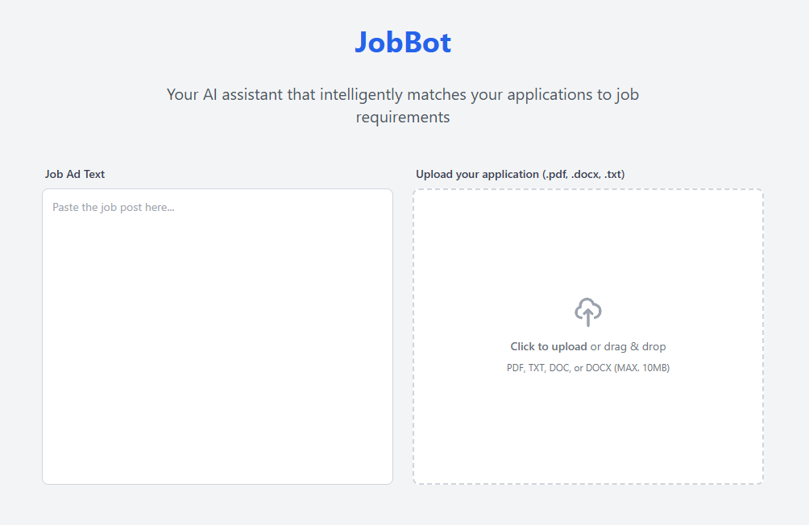
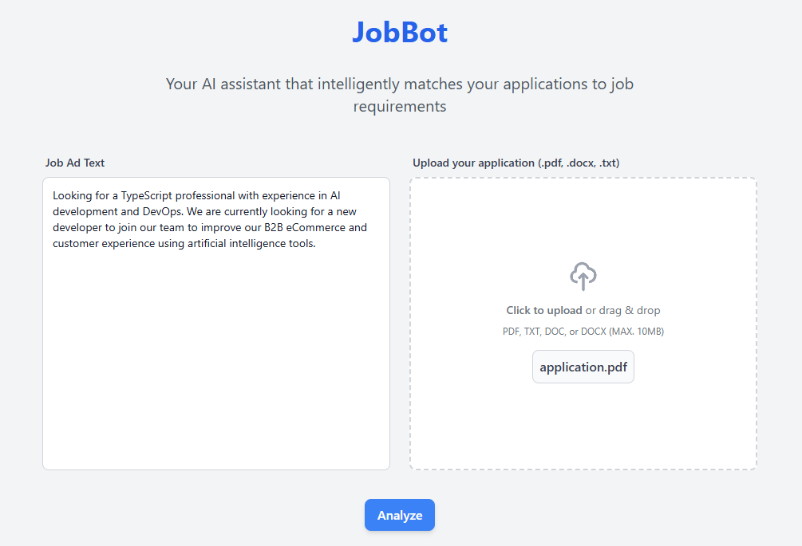

# JobBot - Application Tailor

A web application that helps users tailor their job applications to match specific job descriptions using AI.

## Table of Contents

- [Features](#features)
- [Project Structure](#project-structure)
- [Prerequisites](#prerequisites)
- [Setup](#setup)
- [Development](#development)
- [Screenshots](#screenshots)

## Features

- Upload job applications in multiple formats (PDF, DOCX, TXT)
- Input job descriptions
- AI-powered analysis and tailoring of applications
- Real-time upload progress tracking
- Minimalistic, responsive & easy-to-use UI design

## Project Structure

The project consists of two main parts:

### Backend

- Node.js/Express server
- TypeScript
- WizardLM-2 AI model from Ollama
- File parsing support for PDF, DOCX, and TXT formats

### Frontend

- React with TypeScript
- Vite for build tooling
- Tailwind CSS for styling
- Axios for API communication

## Prerequisites

- Node.js
- NPM
- Ollama installed locally

## Setup

1. Clone the repository:

   ```bash
   git clone https://github.com/pr0fix/JobBot.git
   ```

2. Install backend dependencies:
   ```bash
   cd backend
   npm install
   ```
3. Install frontend dependencies:
   ```bash
   cd frontend
   npm install
   ```

## Development

1. Start the backend server:
   ```bash
   cd backend
   npm run dev
   ```
   The server will run on http://localhost:3000

2. Start the frontend server:
   ```bash
   cd frontend
   npm run dev
   ```
   The client will be available at http://localhost:5173

## Screenshots

#### Landing page


#### Analysis form filled with mock-data

